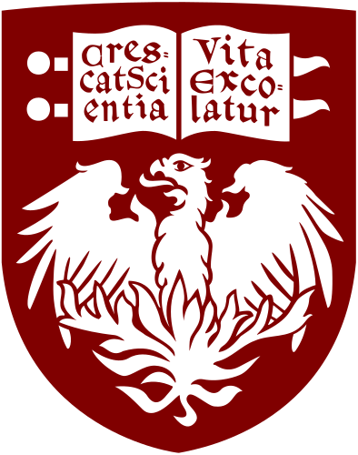

<!-- Typing SVG by DenverCoder1 - https://github.com/DenverCoder1/readme-typing-svg -->

  <!-- Changed font to Roboto, size to 20 -->
  

  
  
  
  
   
  <strong>Location:</strong> Chicago, IL

<!-- Optional Visitor Count Badge -->
<!-- 

  

 -->

---

**Hello!** I’m a passionate Machine Learning Engineer and Data Scientist who loves solving real-world problems using AI, Computer Vision, and NLP techniques. I enjoy collaborating on innovative projects, sharing knowledge, and continuously learning about the latest tech trends.

## 📑 Table of Contents

1. [Work Experience](#-work-experience)
2. [Skills](#-skills)
3. [Education](#-education)
4. [Achievements](#-achievements)
5. [Featured Projects](#-featured-projects)
6. [Let's Connect](#-lets-connect)

## 💼 Work Experience

### Phoenix AI – The University of Chicago (Chicago, IL)
**Student AI Developer | January 2024 – Present**  
- Led development and implementation of personalized Large Language Models (LLMs) for AI-powered academic support systems, serving 15,000+ University of Chicago students  
- Researched and executed innovative Retrieval-Augmented Generation (RAG) techniques, improving LLM response times by 30%  
- Evaluated 10+ distinct Large Language Model solutions to enhance university applications

### CEHD – The University of Chicago (Chicago, IL)
**Research Assistant | December 2024 – Present**  
- Developed a computer vision pipeline on GCP to analyze 11,000+ hours of video data using pose estimation and action recognition algorithms  
- Implemented a multi-camera stereo vision system with YOLOv8 and Deep SORT, achieving real-time tracking at 15 FPS  
- Created a 3D interactive model using NeRF and point cloud techniques for detailed behavioral analysis

### Autonomo Technologies (Bangalore, India)
**Computer Vision Engineer | November 2021 – August 2024**  
- Implemented advanced computer vision models (YOLOv7, YOLOv5, Deep SORT, Reid) with PyTorch for 100+ real-time cameras and sensor feeds  
- Engineered depth sensing capabilities to track 500+ SKUs in real-time, improving inventory accuracy by 40%  
- Enhanced a recommendation model for automated shopper exits with 95% confidence, integrating Kafka to clear virtual carts

### Scienaptic AI (Bangalore, India)
**Machine Learning Engineer | November 2020 – October 2021**  
- Developed a custom YOLOv5 object detection model trained on 10,000+ documents across 80+ bank statement formats for text boundary detection  
- Implemented an AWS OCR-based solution with 75% accuracy in extracting data from scanned documents  
- Designed a LexisNexis data model (Decision Trees) with 96% accuracy, automating 70% of KPI reporting workflows

### Adventum Advanced Solutions (Bangalore, India)
**Artificial Intelligence Engineer | January 2020 – October 2020**  
- Built a custom ResNet classification model for Diabetic Retinopathy, Glaucoma, and AMD using proprietary OCT data, achieving 98% accuracy post-deployment on AWS  
- Created a real-time facial recognition system with the OpenVINO toolkit at 96% accuracy, deployed on an edge camera using an Intel Neural Stick  
- Developed a one-class classification model (CNN) on Fundus images with 95% accuracy

## 💻 Skills

**Programming Languages**  

  
  &nbsp;&nbsp;&nbsp;
  
  &nbsp;&nbsp;&nbsp;
  
  &nbsp;&nbsp;&nbsp;
  

**Technologies & Tools**  
- AWS, Agile, Wireshark, GitHub, Excel, Docker, MLflow, Kafka, OpenVINO, MongoDB, Intel Neural Stick

**Machine Learning Libraries**  
- Pandas, Scikit-Learn, NumPy, spaCy, Seaborn, Matplotlib, PyTorch, OpenCV, TensorFlow

**Core Skills**  
- Machine Learning, Computer Vision, Deep Learning, NLP, LLMs, Statistical Analysis, Data Mining, Data Visualization

## 🎓 Education

**Master of Science in Applied Data Science**  
 *The University of Chicago, Chicago, IL*

**Bachelor of Technology in Computer Science & Engineering**  
 *BML Munjal University, Gurgaon, India*

## 🏆 Achievements
- **Harvard Alumni Entrepreneurs Accelerator Award** for Autonomo Technologies as Startup of the Year (2021)  
- Conducted AI hackathons and workshops as **Vice President** of the SATA Club at BML Munjal University

## 🌟 Featured Projects

Here are a few highlights of my open-source work. Visit my [GitHub Repositories](https://github.com/Mahenderreddyp?tab=repositories) for more.

1. **Dental Xray Anomaly Detection**  
   - **Description**: The **Dental X-ray Anomaly Detection project** is designed to identify and segment dental anomalies such as cavities, fractures, and other abnormalities in dental X-rays. Leveraging the power of YOLOv8 segmentation, the project achieves precise detection and segmentation, enabling detailed analysis and aiding dental professionals in diagnosis and treatment planning.

    - The model is trained and evaluated using the **Tufts Dental Database**, a comprehensive collection of dental X-rays curated for research and medical applications. The project incorporates preprocessing, training, evaluation, and visualization pipelines, ensuring an end-to-end solution for anomaly detection in dental imaging.

    - By automating the detection of dental issues, this project aims to streamline diagnostic processes, improve patient outcomes, and contribute to advancements in dental AI technology.         

    **Tech Stack**
   - **Frameworks and Libraries:**
        - YOLOv8 (Object detection and segmentation)
        - PyTorch (Deep learning framework)
        - Ultralytics YOLOv8 tools

    - **Data and Preprocessing:**
        - Tufts Dental Database
        - OpenCV (Image processing and augmentation)

    - **Utilities:**
        - NumPy (Numerical computations)
        - Matplotlib (Visualization)

    - **Environment:**
        - Python 3.8+
        - Jupyter Notebooks (optional)`
   - **Repo Link**: [Dental Xray Anomaly Detection](https://github.com/Mahenderreddyp/Dental_Xray_Anamoly_Detection)

2. **Project B**  
   - **Description**: The **LEGAL-ANALYSIS** project leverages advanced natural language processing (NLP) techniques to facilitate the analysis of complex legal documents. By utilizing powerful language models, the project offers key functionalities such as document summarization, information retrieval, and an interactive chatbot interface for querying legal texts. This system aims to streamline the analysis of legal materials, making it easier for users to comprehend, search, and extract relevant information efficiently. Whether it's summarizing lengthy contracts or answering specific legal queries, this project enhances productivity and reduces the time required for manual analysis.

    - The project integrates **Ollama** for language model inference and incorporates features like configuration management and logging for robust and scalable performance. Its modular design enables seamless document processing and provides a user-friendly interface for both technical and non-technical users. By combining cutting-edge NLP capabilities with practical applications, **LEGAL-ANALYSIS** serves as a valuable resource for legal professionals, researchers, and anyone working with large volumes of legal data.

    **Tech Stack** 
    - **NLP Frameworks and Libraries:**
        - Ollama (Language model inference)
        - Hugging Face Transformers (Optional, for pre-trained models)
        - spaCy (Text preprocessing)

    - **Core Python Libraries:**
        - pandas (Data manipulation)    
        - NumPy (Numerical computations)
        - logging (Application logging)

    - **Backend and Environment:**
        - Python 3.9
        - Flask or FastAPI (Optional, for chatbot/API)

    - **Visualization:**
        - Matplotlib, seaborn (Data insights)

    - **Tools and Configuration:**
        - Configparser (Configuration management)
        - Shell utilities (For Ollama integration)
 
   - **Repo Link**: [Legal AI Analysis](https://github.com/Mahenderreddyp/LEGAL-ANALYSIS)

## 🤝 Let’s Connect

&nbsp;&nbsp;&nbsp;

&nbsp;&nbsp;&nbsp;

I’m always open to discussing data science, AI projects, and collaboration opportunities. Feel free to reach out!

---

*Thank you for visiting my profile! I look forward to connecting and sharing more about my journey in Machine Learning and Data Science.*
